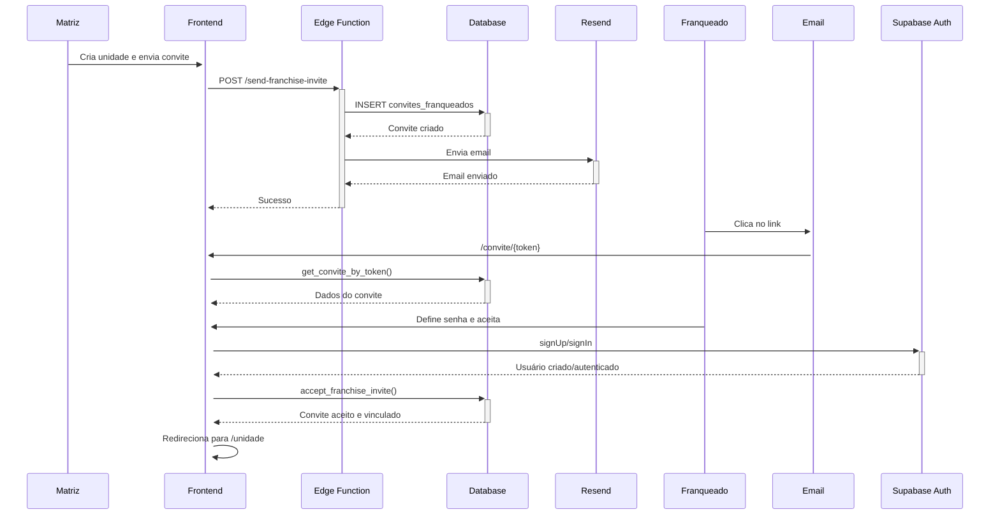
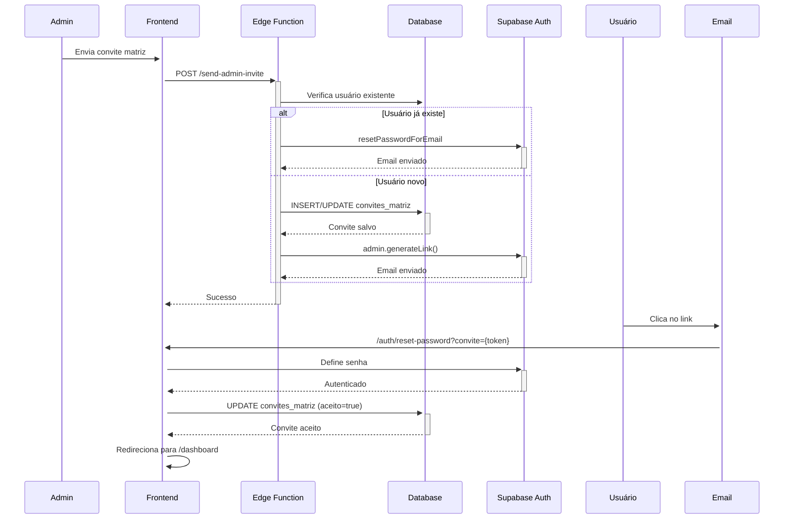

# Sistema de Emails de Convite - MedPass Gestão

## Visão Geral

O sistema de convites do MedPass Gestão permite que administradores convidem novos usuários para acessar a plataforma através de emails personalizados. O sistema suporta dois tipos distintos de convites: **Convites para Franqueados** (unidades) e **Convites para Administradores** (matriz).

## Tipos de Convite

### 1. Convite para Franqueados (`convites_franqueados`)

Permite que a matriz convide gestores de franquias/unidades para acessar o sistema.

**Características:**
- Associado a uma unidade específica (`unidade_id`)
- Email customizado com identidade visual MedPass
- Link de convite válido por 7 dias
- Criação automática de conta de usuário tipo "unidade"
- Vinculação automática entre usuário e unidade após aceite

**Fluxo:**
1. Matriz envia convite através da interface de gestão de unidades
2. Sistema cria registro na tabela `convites_franqueados` com token único
3. Edge Function `send-franchise-invite` envia email via Resend
4. Franqueado clica no link e acessa página de aceite (`/convite/{token}`)
5. Usuário define senha e aceita convite
6. Sistema cria conta de autenticação e vincula à unidade
7. Convite marcado como aceito

### 2. Convite para Administradores (`convites_matriz`)

Permite que administradores existentes convidem novos administradores para o painel matriz.

**Características:**
- Não vinculado a unidades específicas
- Utiliza sistema de autenticação nativo do Supabase
- Email de convite gerado pelo Supabase Auth
- Link de convite válido por 7 dias
- Criação de perfil tipo "matriz"

**Fluxo:**
1. Administrador envia convite através do painel de configurações
2. Sistema verifica se usuário já existe
   - Se existir: envia email de reset de senha
   - Se não existir: cria novo convite
3. Edge Function `send-admin-invite` utiliza `supabase.auth.admin.generateLink()`
4. Usuário recebe email e acessa link de redefinição de senha
5. Define senha e cria conta
6. Convite marcado como aceito

## Arquitetura Técnica

### Tabelas do Banco de Dados

#### `convites_franqueados`
```sql
- id (uuid, PK)
- unidade_id (uuid, FK → unidades)
- email (text)
- token (text, unique)
- expires_at (timestamp)
- aceito (boolean, default: false)
- user_id_aceito (uuid, nullable)
- created_at (timestamp)
- updated_at (timestamp)
```

#### `convites_matriz`
```sql
- id (uuid, PK)
- email (text)
- token (text, unique)
- expires_at (timestamp)
- aceito (boolean, default: false)
- user_id_aceito (uuid, nullable)
- created_by (uuid, FK → auth.users)
- created_at (timestamp)
- updated_at (timestamp)
```

### Edge Functions

#### `send-franchise-invite`
**Arquivo:** [`supabase/functions/send-franchise-invite/index.ts`](../supabase/functions/send-franchise-invite/index.ts)

**Responsabilidades:**
- Validar dados de entrada (unidadeId, email, nome)
- Gerar token único (UUID)
- Salvar convite na tabela `convites_franqueados`
- Enviar email personalizado via Resend
- Construir URL de convite baseada no ambiente
- Timeout de 15 segundos para envio de email

**Variáveis de Ambiente:**
- `SUPABASE_URL`
- `SUPABASE_SERVICE_ROLE_KEY`
- `RESEND_API_KEY` (opcional - se ausente, apenas cria convite sem enviar email)

**Template de Email:**
- Design responsivo com gradiente azul MedPass
- Informações da unidade
- Botão CTA destacado
- Link alternativo para copiar/colar
- Aviso de expiração em 7 dias

#### `send-admin-invite`
**Arquivo:** [`supabase/functions/send-admin-invite/index.ts`](../supabase/functions/send-admin-invite/index.ts)

**Responsabilidades:**
- Verificar se usuário já existe
- Criar/atualizar convite na tabela `convites_matriz`
- Gerar link de convite via Supabase Auth
- Gerenciar convites duplicados (atualiza existentes)
- Limpar convites pendentes antigos do mesmo email

**Lógica Especial:**
- Se usuário existe: envia reset de senha em vez de novo convite
- Se convite pendente existe: atualiza token e data de expiração
- Remove convites duplicados após criar novo

### Componentes Frontend

#### `AcceptInvite.tsx`
**Arquivo:** [`src/pages/auth/AcceptInvite.tsx`](../src/pages/auth/AcceptInvite.tsx)

**Funcionalidades:**
- Validação de token de convite
- Detecção automática do tipo de convite (franqueado vs matriz)
- Formulário de criação de senha
- Autenticação/criação de conta
- Vinculação automática usuário-unidade (franqueados)
- Redirecionamento para área apropriada após aceite

**Estados do Convite:**
- `loading`: Validando token
- `error`: Token inválido/expirado/já aceito
- `ready`: Pronto para aceite

#### `useConvites` Hook
**Arquivo:** [`src/hooks/useConvites.ts`](../src/hooks/useConvites.ts)

**Funcionalidades:**
- Buscar lista de convites
- Verificar status de convites por unidade
- Reenviar convites
- Marcar convite como aceito manualmente
- Sincronizar status de convites (detecta aceites não registrados)

**Status de Convite:**
- `not_sent`: Nenhum convite enviado
- `sent`: Enviado e aguardando aceite
- `accepted`: Aceito pelo usuário
- `expired`: Expirado (> 7 dias)

#### `AdminUsersTab.tsx`
**Arquivo:** [`src/components/admin/AdminUsersTab.tsx`](../src/components/admin/AdminUsersTab.tsx)

**Funcionalidades:**
- Interface para enviar convites matriz
- Listar usuários ativos
- Listar convites pendentes
- Reenviar convites
- Remover convites

### Funções SQL

#### `accept_franchise_invite()`
**Arquivo:** [`supabase/migrations/20250915000001-accept_invite_function.sql`](../supabase/migrations/20250915000001-accept_invite_function.sql)

**Tipo:** `SECURITY DEFINER` - Executa com permissões elevadas

**Operações:**
1. Atualiza convite para aceito
2. Vincula usuário à unidade
3. Retorna informações da unidade

**Segurança:**
- Verifica se convite não expirou
- Verifica se convite não foi aceito anteriormente
- Operação atômica (transação)

#### `get_convite_by_token()`
**Função RPC para buscar convite por token de forma segura**

**Retorno:**
```json
{
  "id": "uuid",
  "email": "user@example.com",
  "unidade_id": "uuid",
  "expires_at": "timestamp",
  "aceito": false
}
```

## Fluxo Completo do Sistema

### Convite para Franqueado



### Convite para Administrador



## Segurança

### Proteções Implementadas

1. **Tokens Únicos:** Cada convite usa UUID v4 como token
2. **Expiração:** Convites expiram em 7 dias
3. **Uso Único:** Convites não podem ser aceitos duas vezes
4. **CORS:** Headers CORS configurados nas Edge Functions
5. **RLS (Row Level Security):** Controle de acesso no banco de dados
6. **SECURITY DEFINER:** Funções SQL executam com permissões controladas
7. **Validação de Email:** Validação básica de formato de email
8. **Timeout:** Edge Functions têm timeout para operações de banco e email

### Tratamento de Erros

#### Edge Functions
- Validação de variáveis de ambiente
- Timeout para operações de banco (10s) e email (15s)
- Logs estruturados com contexto
- Respostas de erro com CORS correto
- Fallback gracioso se email falhar (convite ainda é criado)

#### Frontend
- Toasts informativos para sucesso/erro
- Estados de loading durante operações
- Validação de formulários com Zod
- Mensagens específicas para cada tipo de erro

## Gerenciamento de Estado

### React Query (TanStack Query)

**Query Keys:**
- `['convites', userId]` - Lista de convites por usuário
- `['adminUsers']` - Usuários matriz e convites pendentes

**Invalidação de Cache:**
- Após enviar convite
- Após aceitar convite
- Após sincronizar status

## Configuração de Ambiente

### Variáveis Necessárias

**Supabase:**
- `SUPABASE_URL` - URL do projeto Supabase
- `SUPABASE_SERVICE_ROLE_KEY` - Chave de serviço com permissões elevadas

**Resend (Email):**
- `RESEND_API_KEY` - API key do Resend (opcional para dev)

**Frontend:**
- Configuradas automaticamente pelo Vite/Supabase client

### URLs de Ambiente

**Desenvolvimento:**
- Base URL: `http://localhost:8080`

**Preview (Lovable):**
- Base URL: Detectada automaticamente do request

**Produção:**
- Base URL: `https://www.medpassbeneficios.com.br`

## Manutenção e Monitoramento

### Logs

Todas as Edge Functions implementam logging estruturado:
```typescript
logStep('Passo da operação', { contexto: 'detalhes' })
```

### Sincronização Automática

O hook `useConvites` oferece função `syncInviteStatuses()` que:
- Busca convites pendentes
- Verifica se existem usuários ativos com emails correspondentes
- Atualiza automaticamente convites aceitos fora do fluxo padrão
- Retorna estatísticas da sincronização

### Troubleshooting

**Convite não chega:**
- Verificar `RESEND_API_KEY` configurada
- Verificar logs da Edge Function
- Verificar domínio de envio autorizado no Resend

**Erro ao aceitar convite:**
- Verificar se token não expirou
- Verificar se convite não foi aceito anteriormente
- Verificar logs do browser console

**Usuário criado mas não vinculado à unidade:**
- Executar `syncInviteStatuses()` manualmente
- Verificar função `accept_franchise_invite()` no banco

## Melhorias Futuras

1. **Templates de Email Customizáveis:** Permitir personalização dos emails
2. **Notificações:** Notificar matriz quando convite for aceito
3. **Histórico:** Manter histórico completo de convites enviados
4. **Analytics:** Rastrear taxa de aceite e tempo médio de resposta
5. **Resend Automático:** Reenvio automático antes da expiração
6. **Preview de Email:** Visualizar email antes de enviar
7. **Múltiplos Destinatários:** Enviar convites em lote

## Referências Rápidas

- Email Service: [Resend](https://resend.com)
- Auth Provider: [Supabase Auth](https://supabase.com/docs/guides/auth)
- Validação: [Zod](https://zod.dev)
- State Management: [TanStack Query](https://tanstack.com/query)
